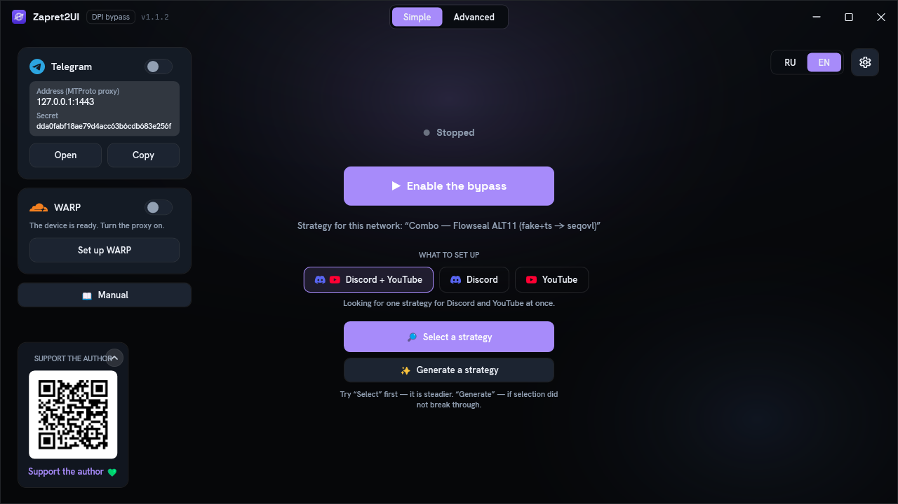
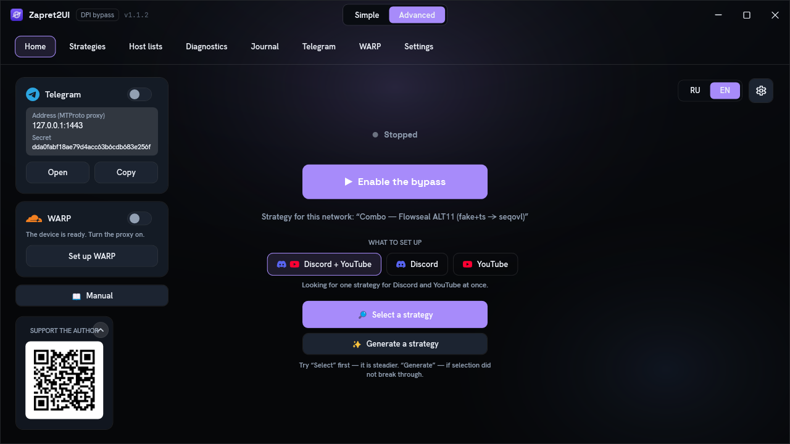

<div align="center">

**EN** | [RU](README.md "Читать по-русски")


# Zapret2UI

**A program that brings Discord, YouTube and Telegram back on Windows with one button.**

<p>
  
  &nbsp;&nbsp;&nbsp;&nbsp;
  
  &nbsp;&nbsp;&nbsp;&nbsp;
  
</p>

<p>
  <a href="https://github.com/Asterlike/zapret2UI/releases/latest"></a>
  <a href="https://github.com/Asterlike/zapret2UI/releases"></a>
  <a href="https://github.com/Asterlike/zapret2UI/stargazers"></a>
  <a href="https://t.me/Zapret2UI"></a>
</p>

<p>
  <a href="https://github.com/Asterlike/zapret2UI/releases/latest"></a>
  &nbsp;
  <a href="https://asterlike.github.io/zapret2UI/en/"></a>
</p>

A convenient shell for the [zapret2](https://github.com/bol-van/zapret2) DPI-bypass engine (`winws2`).
No editing `.cmd` files, no wrestling with the command line, no picking parameters by hand — press a
button and it works. And if it does not work with your provider straight away, the program works
through the bypass methods itself and adapts to your network.

Chat, news and the changelog are in the [Zapret2UI Telegram channel](https://t.me/Zapret2UI) (in Russian).

**Note on language:** the program is available in **Russian and English** — switch with the RU | EN
toggle at the top of the Home screen or in Settings (switching restarts the app to apply). This README
and the [English documentation](https://asterlike.github.io/zapret2UI/en/) describe every screen in
detail. The engine's raw log output stays technical, as it comes straight from `winws2`.



</div>

> ⚠️ A tool for research and educational purposes, for restoring access to legal resources and for
> network testing. Use it in accordance with the laws of your country.

---

## Documentation

This is the short version. Everything is covered in detail on the
**[documentation site](https://asterlike.github.io/zapret2UI/en/)**:

| Section | What it covers |
|---|---|
| [How it works](https://asterlike.github.io/zapret2UI/en/how-it-works.html) | Theory without formulas: SNI and DPI, splitting, fake packets, fooling, zapret2 versus zapret, why it is not a VPN |
| [Quick start](https://asterlike.github.io/zapret2UI/en/quickstart.html) | Installation, first launch, selection and generation, autostart |
| [Interface](https://asterlike.github.io/zapret2UI/en/interface.html) | Every screen with a screenshot, host lists, the Telegram proxy, all settings, files on disk |
| [Strategies explained](https://asterlike.github.io/zapret2UI/en/strategies.html) | All nine built-in strategies line by line: what each argument does and why it is assembled that way |
| [Reference](https://asterlike.github.io/zapret2UI/en/reference.html) | The `winws2` argument format: desync verbs, fooling, tokens, markers, blobs, orchestrators |
| [Troubleshooting](https://asterlike.github.io/zapret2UI/en/troubleshooting.html) | What to try in order, engine exit codes, frequent questions |
| [Support](https://asterlike.github.io/zapret2UI/en/support.html) · [Credits](https://asterlike.github.io/zapret2UI/en/credits.html) | Donations, feedback, and everyone the project stands on |

The site has search (`Ctrl K`), a dark theme, and screenshots that open full size.
The same material as a single file for offline reading: [manual_zapret2UI.en.md](manual_zapret2UI.en.md).

Русская версия: **[README.md](README.md)** · [документация](https://asterlike.github.io/zapret2UI/).

---

## Contents

- [This is zapret2, not the ordinary zapret](#this-is-zapret2-not-the-ordinary-zapret)
- [What the program does](#what-the-program-does)
- [Quick start](#quick-start)
- [Screen by screen](#screen-by-screen)
- [Telegram](#telegram)
- [How it works](#how-it-works)
- [If it does not work](#if-it-does-not-work)
- [Frequent questions](#frequent-questions)
- [Files and removal](#files-and-removal)
- [Building](#building)
- [Support](#support)

---

## This is zapret2, not the ordinary zapret

The program works with **zapret2** (the `winws2` engine), the new generation of bol-van's project. It
is **not compatible** with the old zapret (`winws`): different argument names, a different strategy
format, its own driver.

If you used the ordinary zapret before, or builds such as "Zapret 2 GUI" (which, despite the digit in
the name, most often run the first zapret inside), **your old configs do not apply here** and simply
will not start.

More in the documentation: [How it works → This is zapret2, not the ordinary zapret](https://asterlike.github.io/zapret2UI/en/how-it-works.html#ne-zapret1).
The official engine manual: [manual.en.md](https://github.com/bol-van/zapret2/blob/master/docs/manual.en.md).

---

## What the program does

- **One-click bypass** for Discord and YouTube, with no manual configuration.
- **A separate built-in Telegram proxy** (MTProto) that works on its own and needs no administrator
  rights.
- **9 ready-made bypass strategies** plus **automatic selection** of the best one plus **generation of
  a personal strategy** assembled specifically for your provider.
- **Per-network memory**: the program remembers the working strategy for each network (home Wi-Fi,
  work, mobile internet) and turns it on by itself next time.
- **Auto-repair**: if the bypass stops working because the provider updated its filters, the program
  notices and quietly re-selects a working variant.
- **Diagnostics**: an availability table plus a separate check for whether the provider is interfering
  via DPI specifically.
- **Built-in Cloudflare WARP** as a local SOCKS5 proxy: the other half of the job. The bypass removes
  the first obstacle — a provider that will not let you reach the site. The second obstacle is the site
  itself: it looks at the address you came from and checks its reputation. Russian home ranges score
  badly with anti-fraud systems, and the low score lands on the whole range at once — hence the endless
  captchas, the "access restricted" pages and the refusals at sign-up or payment, even though the site
  opens and the provider has nothing to do with it. WARP's addresses belong to Cloudflare, which already
  carries a sizeable share of the web, so they sit differently in those reputation lists: **you arrive
  not from a bad range but as a Cloudflare client** — and the same check lets you through.
  The client is carried inside the program, so **there is nothing to install** and **no administrator
  rights are needed**: no adapter, no routes, nothing changed in the system, so a failure cannot leave
  you without internet. It speaks MASQUE — the same protocol Cloudflare's own app uses.
  *This does not change your country:* free WARP exits through the nearest node, from Russia the address
  will be Russian, and "not available in your region" cannot be got round this way — what changes is the
  address's reputation, not the country. While the proxy is on, **the bypass scope widens to every site
  by itself** — otherwise the connection to Cloudflare does not come up; your setting is kept and comes
  back when you switch the proxy off. Normally only what you point at the proxy uses it, but a separate
  switch writes it into Windows' settings and sends **all system traffic** through it (Firefox reads its
  own setting and is not covered).
- **Your own site lists** (host lists) and **your own targets**: any domain can be added.
- **Autostart** at Windows logon, minimise to tray, quiet notifications in the corner.
- **A backup of your settings and strategies** in a single file — for a reinstall or a move to another
  computer — plus a **settings reset** that leaves your own strategies untouched.
- **One file, no installation.** The engine is downloaded on first launch and verified against SHA-256.

---

## Quick start

Download a single **`Zapret2UI.exe`** from the
[releases page](https://github.com/Asterlike/zapret2UI/releases/latest) — no installation, no .NET to
install. The first two steps are usually enough.

**1. Run it as administrator.**
Right-click the icon → "Run as administrator" (or accept the UAC prompt). The engine has to load a
network driver into the Windows kernel; without administrator rights the bypass will not turn on.

**2. Press the big "Включить обход" (Turn on bypass) button.**
The status dot turns green and the caption changes to "Работает" (Running). Check Discord and YouTube:
in most cases that is where it ends.

**3. Did not open? The "Диагностика" (Diagnostics) tab → "Подобрать" (Select).**
The program works through the ready-made strategies, checks availability and keeps the best one. Did
not help? In the same place, **"Сгенерировать" (Generate)**: slower, but it assembles a strategy for
your network.

**4. Settings → "Добавить в исключения" (Add to exclusions).**
The antivirus is the most common reason a bypass "does not work" or the engine "disappears". One click
registers the program and the engine folder with Windows Defender and the firewall.

> 💡 You normally do not have to set it up again: the program remembers the successful strategy for
> each network (by the router's address; nothing is sent to the internet).

More in the documentation: [Quick start](https://asterlike.github.io/zapret2UI/en/quickstart.html).

---

## Screen by screen

At the top centre is the **Простой / Расширенный** (Simple / Advanced) switch. Simple leaves the toggle,
the Telegram and WARP cards and the target selector; advanced adds eight tabs.



| Tab | What is there |
|---|---|
| **Главная** (Home) | The bypass toggle, the state, the target (Discord / YouTube / both), the Telegram and WARP cards, the selection and generation buttons |
| **Стратегии** (Strategies) | The list of ready-made bypass methods and your saved ones. Select a row → "Применить" (Apply) |
| **Хостлисты** (Host lists) | Domain lists the bypass applies to. Built-in ones refresh themselves; yours are left alone |
| **Диагностика** (Diagnostics) | The availability table by service, selection, generation and the DPI check |
| **Журнал** (Journal) | Live output from the engine and the proxy. The first place to look if the bypass did not start |
| **Telegram** | The built-in proxy: address, secret, port, autostart |
| **WARP** | The Cloudflare proxy for changing your address: create a device, turn it on, where to point it |
| **Настройки** (Settings) | Scale, engine updates, autostart, notifications, auto-repair, bypass scope, game filter, QUIC, backup, settings reset, log cleanup |

More in the documentation: [Interface](https://asterlike.github.io/zapret2UI/en/interface.html) — every
screen with a screenshot, the full settings table and a breakdown of host lists.

---

## Telegram

Telegram is blocked differently from websites — often **by IP address** rather than by name. An
ordinary DPI bypass does not help there, so the program has **a separate built-in proxy** (MTProto). It
works on its own, **independently of the main bypass button**, and administrator rights are **not
needed**.

1. Turn on the **Telegram switch** (on Home or on the Telegram tab).
2. Press **"Открыть в Telegram"** (Open in Telegram) — the proxy is registered in the app
   automatically.
3. Done. Leave the switch on while you use Telegram.

> 💡 The proxy keeps working even when the window is minimised to the tray. If Telegram did not pick it
> up automatically, go to **Settings → Data and Storage → Proxy** and add it by hand: the address, port
> and secret are shown on the Telegram tab, with a copy button next to them.

The mechanism is the same as in [Flowseal/tg-ws-proxy](https://github.com/Flowseal/tg-ws-proxy):
MTProto over WebSocket-TLS, and through domains behind Cloudflare when the direct path is closed. The
difference is that the original is a separate Python program, while here the protocol is **rewritten in
C#** and built into the application: no second process and no Python runtime.

A second difference: **chat and media travel by different routes.** Telegram downloads files separately
from the chat and over several connections at once. The original sends both the same way, piling them
into one node — which produces the familiar picture where messages arrive instantly but photos and
videos never load.

Here the route depends on what is travelling. Chat goes **straight to Telegram**: faster, with no
intermediary, and messages are small. Media prefers the **Cloudflare-fronted domains** — they carry bulk
at full speed, and parallel transfers spread across several nodes. Each route backs the other up, so one
being unavailable never leaves you cut off. The difference between them is that the direct road leads to
Telegram's own addresses, which are more often **rate-limited** than closed outright: the connection
opens as if nothing were wrong, yet bulk over it barely crawls.

A third: **large messages are reassembled.** The channel may cut a single message into several pieces,
and only large ones get cut — that is, files. A lost continuation breaks the stream cipher beyond
recovery, which from the outside looks like "media loads sometimes and sometimes not".

More in the documentation: [Interface → Telegram](https://asterlike.github.io/zapret2UI/en/interface.html#telegram).

---

## How it works

- **How you are blocked.** At the start of a secure connection the browser announces the site name in
  plain text (the **SNI** field). The provider's equipment (**DPI/TSPU**) reads it and cuts the
  connection.
- **What the bypass does.** The `winws2` engine alters the first packets slightly so the DPI **does not
  recognise the site name** while the server understands everything correctly. A set of such techniques
  is what a **strategy** is.
- **Why there are nine strategies.** Providers filter differently: a technique that punches through for
  one is useless with another. Hence selection and generation.
- **What the bypass cannot do.** It lifts blocking **by name**. If a resource is cut off **by IP**, only
  a VPN helps (or the built-in proxy, if it is Telegram).

More in the documentation: [How it works](https://asterlike.github.io/zapret2UI/en/how-it-works.html) —
splitting, fake packets, fooling, and why the fake must die on the way.

---

## If it does not work

Work through the steps from the top — one of the first three almost always does it.

1. **Go through the strategies by hand** (Стратегии → select → Применить), in this order:
   `Комбо (рекомендуемый)` → `отечественный (VK)` → `ALT10` → `ALT11` → `Flowseal (multisplit)` →
   `Flowseal ALT` → `окно (wssize)` → `адаптивный`.
   > Discord voice "connects but nobody can be heard" — try `Discord — голос (QUIC-фейк)` separately.
2. **Select or generate** — Диагностика → Подобрать; nothing found → Сгенерировать.
3. **Add to exclusions** — Settings → "Добавить в исключения" (the antivirus).
4. **Turn QUIC off** — Settings → disable **QUIC / HTTP-3**. The classic recipe for "YouTube keeps
   buffering".
5. **Check the journal** — if there is a start-up error there, the problem is the engine, not the
   strategy.
6. **Run the DPI check with the bypass off** — if it says "нет соединения" (no connection), the
   blocking is by IP and only a VPN will help.

More in the documentation: [Troubleshooting](https://asterlike.github.io/zapret2UI/en/troubleshooting.html) —
symptom-by-symptom breakdowns for Discord and YouTube, engine exit codes, and the "all green but the
site will not open" case.

---

## Frequent questions

**The antivirus deletes `winws2.exe`, or it says the engine was not found.**
A false positive, routine for bypass tools. Settings → "Добавить в исключения", then update the engine
in the same place or restart the program — it will download again.

**It worked and then stopped.**
The provider updated its filters. Turn **auto-repair** on in Settings, or press "Подобрать" again.

**Discord text works but voice does not.**
Voice runs over UDP on high ports. Try `Discord — голос (QUIC-фейк)` or `ALT10` / `ALT11`.

**YouTube opens but video loads forever.**
QUIC is often to blame. Settings → disable **QUIC / HTTP-3**.

**Diagnostics is all green but the site will not open.**
The site may be cut off some other way (ECH, IP blocking) — try another strategy or turn QUIC off. If
the page loads forever while `curl` returns it instantly, that is QUIC: add the domain to "Свои цели"
(My targets) and turn on "Отключить QUIC" (Disable QUIC). And if the site opens but refuses *you* — an
endless captcha, "access restricted", a refusal at sign-up — the provider is not the problem, your
address's reputation is: that is a job for **WARP**.

**Are administrator rights required?**
For bypassing Discord/YouTube, yes. For the Telegram proxy, **no**.

Other questions: [Troubleshooting → Frequent questions](https://asterlike.github.io/zapret2UI/en/troubleshooting.html#voprosy).

---

## Files and removal

The program is **portable**: it does not install into `Program Files` and barely touches the system.
All data lives in one folder, **`%LOCALAPPDATA%\Zapret2UI\`** (to open it quickly: `Win+R` → paste the
path → Enter).

| What | Where |
|---|---|
| The `winws2` engine and its files (downloaded on first launch) | `engine\` |
| Host lists and IP lists | `lists\` |
| Engine journals (`engine-*.log`) | `logs\` |
| Your strategies | `presets.json` |
| Settings | `settings.json` |

**How to remove the program completely:**

1. Close it — right-click the tray icon → "Выход" (Exit).
2. If you enabled autostart, remove it: Settings → turn "Запускать Zapret2UI при входе в Windows"
   off (or by hand:
   `schtasks /delete /tn "Zapret2UI Autostart" /f`).
3. Delete `Zapret2UI.exe` itself.
4. Delete the `%LOCALAPPDATA%\Zapret2UI\` folder — after that nothing is left of the program.

**Windows says `WinDivert64.sys` is in use?** That is a kernel driver and it stays loaded until it is
unloaded.

1. Quit the application completely: **tray → Выход** (the close button only minimises). Make sure there
   is no `winws2.exe` in Task Manager.
2. Open **PowerShell as administrator** and unload the driver:
   ```powershell
   sc.exe stop WinDivert
   sc.exe delete WinDivert
   ```
   > ⚠️ Specifically **`sc.exe`**, not `sc`! In PowerShell `sc` is an alias for `Set-Content`, so
   > `sc stop WinDivert` silently does nothing. (In classic `cmd.exe` plain `sc` works too.)
3. The `engine` folder will now delete.

**Simpler:** reboot and then delete the folder — the driver is configured not to load on its own, so
after a restart the file is free.

> If you added exclusions through Settings, harmless Windows Defender and firewall rules named
> `Zapret2UI` will remain — you can remove them from the Windows security settings if you like.

---

## Building

The ready-made binary is `publish\Zapret2UI.exe` (self-contained, no .NET to install; on first launch
the engine is downloaded and verified against SHA-256).

From source you need the **.NET 9 SDK**:

```powershell
# run for development
dotnet run --project ZapretUI/ZapretUI.csproj

# release self-contained single-file exe
dotnet publish ZapretUI/ZapretUI.csproj -c Release -o publish
```

**Requirements:** Windows 10/11 x64, administrator rights (the engine loads a driver into the kernel),
an internet connection on first launch. Built with .NET 9 and WPF; the only external dependency is
Emoji.Wpf (colour emoji).

---

## Support

- **The author's VPN** (for IP-based blocking): **[makeitfree.online](https://makeitfree.online)** ·
  [t.me/makeitfreevpn](https://t.me/makeitfreevpn)
- **Support the project:** **[web.tribute.tg/d/HFh](https://web.tribute.tg/d/HFh)**

You can help without money too: tell the [channel](https://t.me/Zapret2UI) which strategy worked with
which provider, or open an [issue](https://github.com/Asterlike/zapret2UI/issues) with the journal
output. More in the documentation: [Support](https://asterlike.github.io/zapret2UI/en/support.html).

---

## Credits

- [bol-van/zapret2](https://github.com/bol-van/zapret2) — the DPI-bypass engine itself (`winws2`) and
  its documentation.
- [Flowseal/zapret-discord-youtube](https://github.com/Flowseal/zapret-discord-youtube) — working
  strategies and [tg-ws-proxy](https://github.com/Flowseal/tg-ws-proxy).
- [RaccoonLaptop/ZapretUI](https://github.com/RaccoonLaptop/ZapretUI) — the inspiration for the project.
- [hyperion-cs/dpi-checkers](https://github.com/hyperion-cs/dpi-checkers) — the volume-limit detection
  method.

The full list, with what specifically came from where:
[Credits](https://asterlike.github.io/zapret2UI/en/credits.html).

## Licence

MIT (see `LICENSE`). The `winws2` engine ships under its own licence — see the zapret2 repository.
