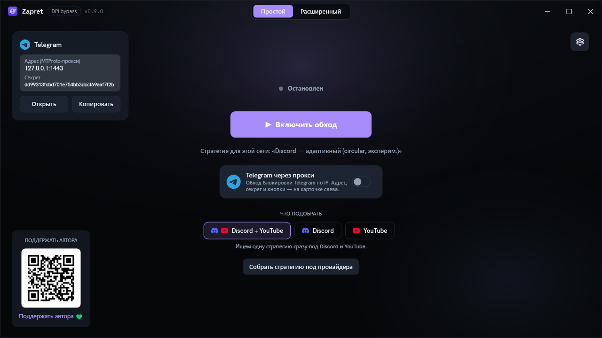
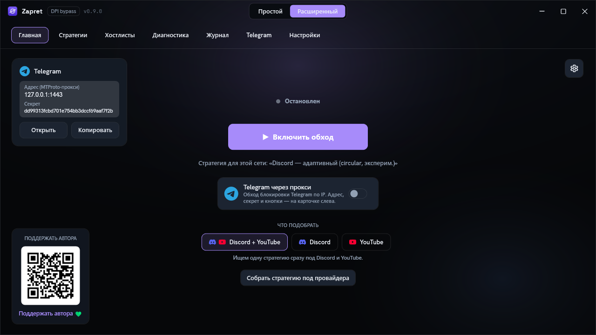
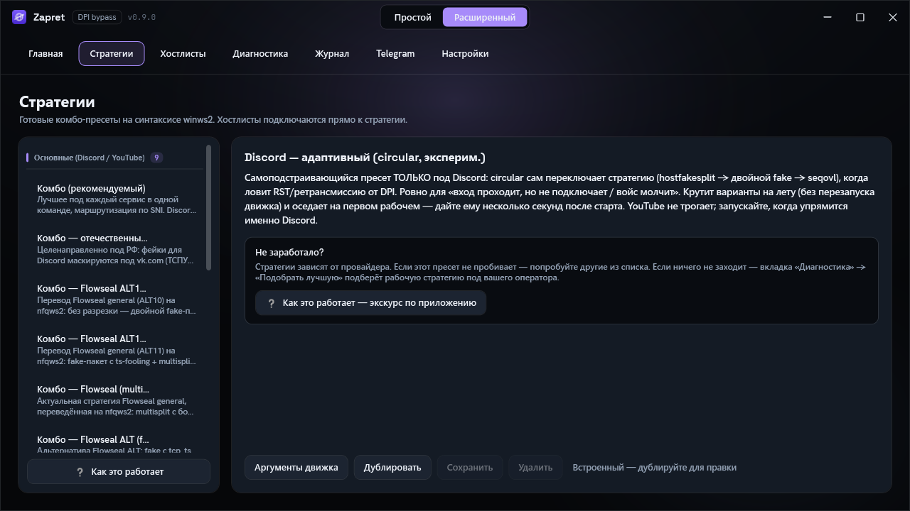
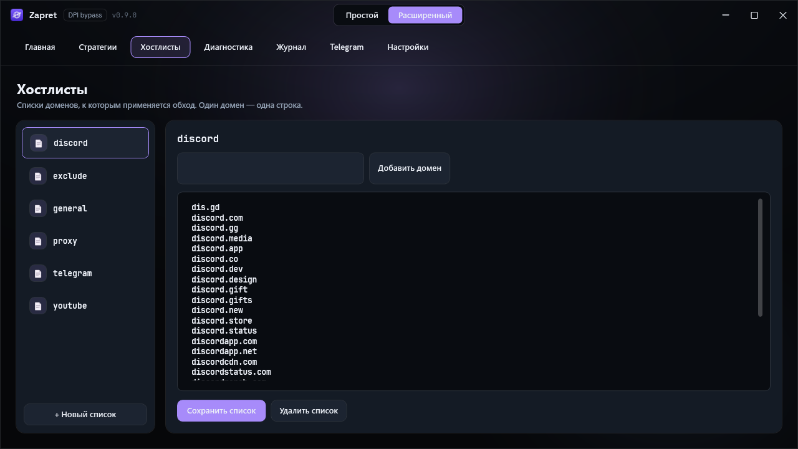
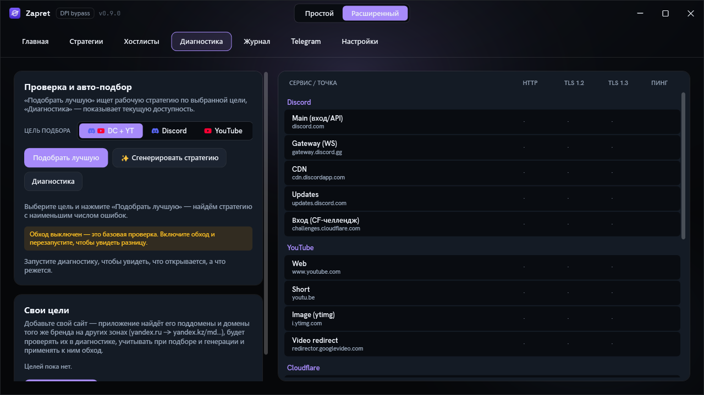
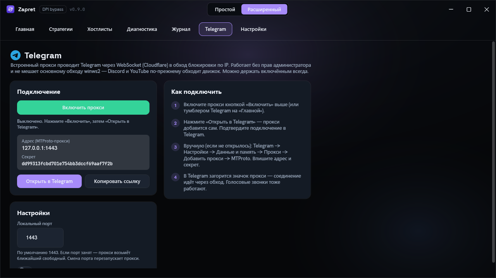
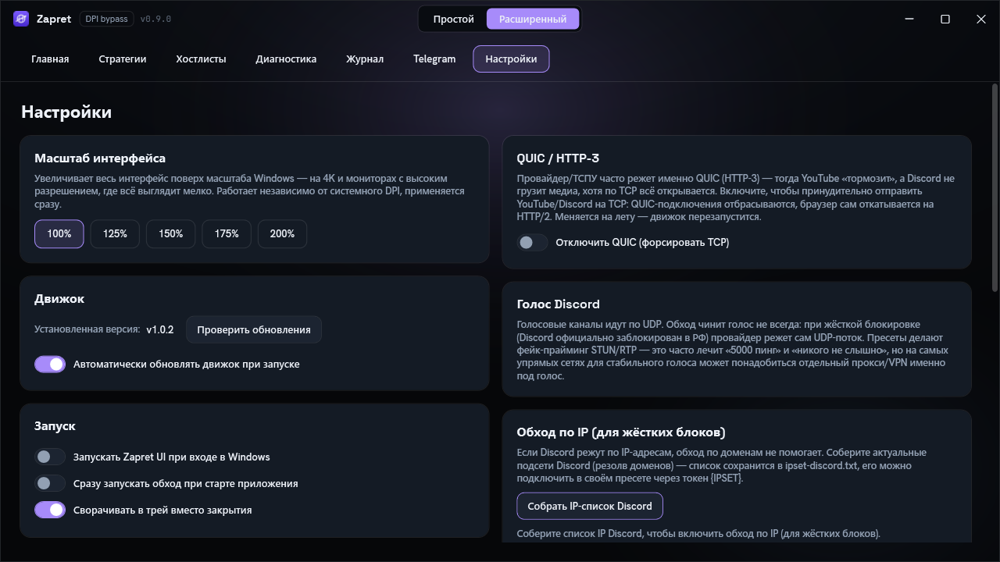

<div align="center">


# Zapret UI

**Программа, которая одной кнопкой возвращает доступ к Discord, YouTube и Telegram на Windows.**

<p>
  
  &nbsp;&nbsp;&nbsp;&nbsp;
  
  &nbsp;&nbsp;&nbsp;&nbsp;
  
</p>

<p>
  <a href="https://github.com/Asterlike/zapret2UI/releases/latest"></a>
  <a href="https://github.com/Asterlike/zapret2UI/releases"></a>
  <a href="https://github.com/Asterlike/zapret2UI/stargazers"></a>
  <a href="https://t.me/Zapret2UI"></a>
</p>

<p>
  <a href="https://github.com/Asterlike/zapret2UI/releases/latest"></a>
</p>

Удобная оболочка для движка обхода блокировок [zapret2](https://github.com/bol-van/zapret2) (`winws2`).
Не нужно править `.cmd`-файлы, разбираться в командной строке и вручную подбирать параметры —
нажали кнопку, и всё работает. А если у вашего провайдера не заработало сразу — программа сама
переберёт способы обхода и подстроится под вашу сеть.

Чат, новости и список изменений — в [Telegram-канале Zapret2UI](https://t.me/Zapret2UI).



</div>

> ⚠️ Инструмент для исследовательских и образовательных целей, восстановления доступа к легальным
> ресурсам и тестирования сетей. Используйте по законам своей страны.

---

## Содержание

- 📖 **[Полный мануал — manual_zapret2UI.md](manual_zapret2UI.md)** — исчерпывающий справочник по всем возможностям
- [Это zapret2, а не обычный zapret](#-это-zapret2-а-не-обычный-zapret)
- [Что умеет программа](#-что-умеет-программа)
- [Быстрый старт для новичка](#-быстрый-старт-для-новичка)
- [Экран за экраном](#-экран-за-экраном) — разбор всех вкладок со скриншотами
- [Telegram](#-telegram)
- [Как это работает](#-как-это-работает)
- [Если ничего не помогает](#-если-ничего-не-помогает)
- [Частые вопросы](#-частые-вопросы)
- [Сборка](#-сборка)
- [Поддержать](#-поддержать)

---

## ⚠️ Это zapret2, а не обычный zapret

Программа работает с **zapret2** (движок `winws2`) — это новое поколение проекта bol-van. Оно **не
совместимо** со старым zapret (`winws`): другие команды в командной строке, другой формат стратегий,
другой драйвер. Если вы раньше пользовались обычным zapret или сборками вроде «Zapret 2 GUI» — здесь
всё устроено иначе, и **старые конфиги сюда не подходят**. Не копируйте параметры из инструкций к
первому zapret — они просто не запустятся.

📖 **Полный мануал по программе** — [manual_zapret2UI.md](manual_zapret2UI.md): все функции,
настройки, формат своих стратегий, файлы на диске и решение проблем.
Официальная документация **движка** —
[manual.en.md](https://github.com/bol-van/zapret2/blob/master/docs/manual.en.md).

---

## ✨ Что умеет программа

- **Обход блокировок в один клик** для Discord и YouTube — без ручной настройки.
- **Отдельный встроенный прокси для Telegram** (MTProto) — работает сам по себе, права администратора
  для него не нужны.
- **8 готовых стратегий** обхода + **авто-подбор** лучшей из них + **генерация личной стратегии**,
  собранной именно под вашего провайдера.
- **Память по сетям** — программа запоминает рабочую стратегию для каждой сети (Wi-Fi дома, на работе,
  мобильный интернет) и в следующий раз включает её сама.
- **Авто-починка** — если обход перестал работать (провайдер обновил фильтры), программа замечает это
  и молча переподбирает рабочий вариант.
- **Диагностика** — таблица доступности: наглядно видно, что именно у вас режется, а что открывается.
- **Свои списки сайтов** (хостлисты) и **свои цели** — можно добавить любой домен.
- **Автозапуск** при входе в Windows, сворачивание в трей, тихие ненавязчивые уведомления в углу.
- **Один файл, без установки.** Движок скачивается при первом запуске и проверяется по контрольной
  сумме SHA-256. Никаких зависимостей ставить не нужно.

---

## 🚀 Быстрый старт для новичка

Ещё нет программы? Скачайте один файл **`ZapretUI.exe`** со [**страницы релизов**](https://github.com/Asterlike/zapret2UI/releases/latest)
— установка не нужна, .NET ставить не надо. Дальше делайте по шагам; обычно хватает первых двух.

**1. Запустите программу от имени администратора.**
Правой кнопкой по значку → «Запуск от имени администратора» (или просто согласитесь на запрос UAC при
старте). Значок с гербом-щитом на кнопке — это нормально, так и должно быть.
> 💡 **Почему это обязательно.** Движку нужно загрузить сетевой драйвер в ядро Windows — без прав
> администратора он этого не сможет, и обход не включится. Один раз можно настроить автозапуск от
> админа в «Настройках», чтобы больше не подтверждать вручную.

**2. Нажмите большую кнопку «Включить обход».**
Точка статуса над кнопкой станет зелёной, надпись — «Работает». Всё, обход запущен.
> 💡 **Если кнопка неактивна или сразу гаснет.** Загляните на вкладку «Журнал» — там будет причина.
> Чаще всего это антивирус (см. шаг 5) или движок ещё не докачался при первом запуске — подождите
> минуту и попробуйте снова.

**3. Проверьте Discord и YouTube.**
Откройте приложение или сайт. В большинстве случаев этого уже достаточно.
> 💡 **Если не открывается.** Подождите 5–10 секунд и обновите страницу. Всё ещё нет — это нормально:
> один и тот же способ обхода работает не у всех провайдеров. Переходите к шагу 4, программа
> подберёт другой.

**4. Откройте вкладку «Диагностика» и нажмите «Подобрать».**
Программа по очереди запустит готовые стратегии, проверит по ним доступность и оставит ту, что
открывает больше всего. Идёт живой прогресс — просто дождитесь конца.
> 💡 **Если ничего не подобралось.** Переходите к шагу 5 — генерация собирает вариант точнее, чем
> готовые заготовки.

**5. Там же нажмите «Сгенерировать».**
Это дольше (программа пробует множество комбинаций параметров), зато на выходе — **личная стратегия**
именно под вашу сеть. Она сохранится, и её можно будет включать одной кнопкой.

**Настраивать заново обычно не приходится.** Программа запоминает удачную стратегию для каждой сети
(по адресу вашего домашнего роутера, ничего в интернет при этом не отправляется) и в следующий раз в
той же сети сразу предложит её.

> 🔀 **Простой и Расширенный режим** переключаются вверху по центру окна. **Простой** — одна кнопка и
> ничего лишнего. **Расширенный** — все вкладки с полным управлением (о них ниже).

---

## 🧭 Экран за экраном

В расширенном режиме сверху семь вкладок: **Главная, Стратегии, Хостлисты, Диагностика, Журнал,
Telegram, Настройки**. Разберём каждую.

### Главная

<p align="center"></p>

Центр управления. Большая кнопка **«Включить / Выключить обход»** — старт и стоп; над ней точка и
подпись показывают текущее состояние (`Остановлен` / `Запуск…` / `Работает`). Под кнопкой — выбор
**цели** обхода: `Discord + YouTube`, `Discord` или `YouTube` (что именно программа старается открыть
при подборе). Слева — карточка встроенного **прокси Telegram** (адрес, секрет, кнопки «Открыть» и
«Копировать») и QR-код для поддержки автора.

> 💡 Если не открывается **конкретный** сайт — не жмите кнопку по кругу, идите на «Диагностику» и
> подберите стратегию. Кнопка лишь включает/выключает обход, сам способ она не меняет.

### Стратегии

<p align="center"></p>

Список готовых способов обхода. Выберите строку и нажмите **«Применить»** — обход перезапустится на
выбранной стратегии. Наведите курсор на строку, чтобы увидеть полное название и описание. Что есть в
списке:

| Стратегия | Когда пробовать |
|---|---|
| **Комбо (рекомендуемый)** | Включается по умолчанию. Лучший способ под каждый сервис в одной команде: Discord → `hostfakesplit`, YouTube → `fake+multidisorder`. Начните с него. |
| **Комбо — отечественный (VK, целевой)** | Под РФ: фейки маскируются под `vk.com`, который ТСПУ обычно не режет. Берите, если google-варианты «зелёные, но Discord не открывают». |
| **Комбо — Flowseal ALT10 (двойной fake + ts)** | Перевод известной стратегии Flowseal. У многих «работает вообще всё». |
| **Комбо — Flowseal ALT11 (fake+ts → seqovl)** | Второй вариант Flowseal — если ALT10 не зашёл. |
| **Комбо — Flowseal (multisplit seqovl)** | Ещё один рабочий профиль на разрезке пакета. |
| **Комбо — окно (wssize)** | Обход через уменьшение TCP-окна — помогает на некоторых провайдерах. |
| **Discord — голос (QUIC-фейк)** | Если текст в Discord есть, а голос «подключается, но не слышно». |
| **Discord — адаптивный (circular, эксперим.)** | Сам чередует способы обхода на ходу. Дайте ему несколько секунд после старта. |

> 💡 Не бойтесь перебирать вручную сверху вниз — какой-то вариант почти всегда подходит под вашего
> провайдера. Порядок перебора подсказан в разделе [«Если ничего не помогает»](#-если-ничего-не-помогает).

### Хостлисты

<p align="center"></p>

Списки сайтов (по одному домену на строку), к которым применяется обход, — `youtube`, `discord` и
другие. Встроенные списки **обновляются сами** при каждом запуске; ваши собственные строки при этом
никто не трогает. Здесь можно создать свой список, отредактировать существующий и выбрать активный.

> 💡 Если нужного сайта нет ни в одном списке — добавьте его домен (например, `example.com`) в
> подходящий список. Быстрее — через кнопку **«Свои цели»** на вкладке «Диагностика».

### Диагностика

<p align="center"></p>

Слева — кнопки действий, справа — **таблица доступности**: по строке на сервис (Discord, YouTube,
Google, Cloudflare, DNS…), по столбцам — виды проверки (Ping, HTTP, TLS 1.2/1.3). Зелёная ячейка —
открывается, красная — режется. Кнопки:

- **Подобрать** — быстрый автоматический выбор из готовых стратегий (шаг 4 быстрого старта).
- **Сгенерировать** — собрать личную стратегию под вашу сеть (дольше, но точнее; шаг 5).
- **Диагностика** — просто проверить, что открывается, а что нет. Ничего не включает и не меняет.
- **Свои цели** — добавить свой сайт, чтобы программа его тоже проверяла и обходила.

> 💡 Порядок при проблемах простой: сначала **«Подобрать»**, не помогло — **«Сгенерировать»**. Оба
> действия запускают движок и требуют прав администратора.

### Журнал

Живой вывод движка `winws2`. Сюда смотрят в первую очередь, **если обход вообще не запустился** —
именно здесь будет причина (ошибка запуска, проблема с драйвером, блокировка антивирусом). Кнопкой
можно очистить журнал, режим `--debug` включает подробный вывод.

> 💡 Если просите помощи в чате — скопируйте последние 10–15 строк журнала. По ним почти всегда видно,
> что пошло не так.

### Telegram

<p align="center"></p>

Отдельная страница встроенного прокси для Telegram: тумблер включения, адрес и секрет прокси, кнопка
**«Открыть в Telegram»**, смена порта и краткая инструкция. Подробно — в разделе
[«Telegram»](#-telegram) ниже.

### Настройки

<p align="center"></p>

Всё остальное, в две колонки:

- **Масштаб интерфейса** — если окно кажется мелким или крупным.
- **Обновление движка** — проверка и загрузка новой версии `winws2`.
- **Запуск с Windows** — автозапуск при входе в систему (от имени администратора, чтобы не
  подтверждать UAC каждый раз) и старт свёрнутым в трей.
- **Уведомления** — два отдельных тумблера: показывать всплывающие уведомления в углу экрана и
  проигрывать тихий звук.
- **Авто-починка** — программа сама переподберёт стратегию, если обход отвалится во время работы.
- **Область обхода** — обходить только сайты из списков (безопасно, как у Flowseal) или вообще все
  сайты.
- **Игровой фильтр** и **QUIC / HTTP-3** — тонкие настройки перехвата (см. подсказки на самой вкладке).
- **«Добавить в исключения»** — одной кнопкой прописывает программу и папку движка в Защитник Windows
  и брандмауэр.

> 💡 Если обход «не работает» без явной причины — начните с кнопки **«Добавить в исключения»**.
> Антивирус, молча блокирующий движок, — самая частая проблема.

---

## ✈️ Telegram

Telegram блокируют иначе, чем сайты, — часто **по IP-адресам**, а не по имени. Обычный обход DPI тут
не поможет, поэтому для Telegram в программе есть **отдельный встроенный прокси** (MTProto). Он
работает сам по себе и **не зависит от основной кнопки обхода**. Права администратора для него **не
нужны** — можно пользоваться, даже не запуская программу от админа.

1. Включите **тумблер Telegram** (на «Главной» или на вкладке «Telegram»).
2. Нажмите **«Открыть в Telegram»** — прокси пропишется в приложение автоматически.
3. Готово. Оставьте тумблер включённым, пока пользуетесь Telegram.

> 💡 Прокси работает, даже когда окно программы свёрнуто в трей. Если Telegram не подхватил прокси
> автоматически — откройте в нём **Настройки → Данные и память → Прокси** и добавьте вручную: адрес,
> порт и секрет показаны на вкладке «Telegram», кнопка «Копировать» рядом.

### Чем это отличается от tg-ws-proxy

Механизм тот же, что у [Flowseal/tg-ws-proxy](https://github.com/Flowseal/tg-ws-proxy): поднимается
локальный MTProto-прокси на `127.0.0.1`, и каждое соединение Telegram уводится к его дата-центрам по
**WebSocket-TLS**, а если прямой путь перекрыт — через **домены за Cloudflare**. Именно поэтому связь
переживает блокировку по IP, которую движок winws2 (он работает по именам сайтов) сам не снимает.

Разница — в реализации:

- **Оригинал** — отдельная программа на **Python**, которую собирают в самостоятельный `.exe`
  (PyInstaller) и запускают рядом.
- **Здесь — нативный порт этого протокола на C#**, встроенный прямо в приложение. Никакого второго
  процесса, Python-рантайма или отдельного бинарника: всё внутри одного `.exe`, включается и
  выключается тумблером Telegram, без прав администратора.
- Порт намеренно сведён к тому, что нужно **локальному** клиенту: реализован только транспорт `dd`
  (обфусцированный MTProto). Маскировка FakeTLS (`ee`) нужна лишь удалённому/публичному прокси и
  опущена — как и оптимизации оригинала (пулы соединений, Cloudflare-worker, доменный фронтинг,
  кулдауны). Оставлен точный рабочий путь: разбор рукопожатия → переобфускация → перешифрующий мост
  поверх WebSocket.

Код ядра — под лицензией MIT, с благодарностью Flowseal.

---

## 🧠 Как это работает

Коротко, без лишнего — чтобы понимать, что делает программа и почему иногда нужно перебирать стратегии.

- **Как вас блокируют.** В начале почти любого защищённого соединения (TLS) браузер открытым текстом
  сообщает имя сайта, к которому подключается (поле **SNI**). Провайдер видит это имя своим
  оборудованием (**DPI/ТСПУ**) и по чёрному списку обрывает соединение.
- **Что делает обход.** Движок `winws2` на лету чуть-чуть изменяет первые пакеты соединения так, что
  DPI **не распознаёт имя сайта**, а настоящий сервер понимает всё правильно. Набор таких приёмов —
  это и есть **стратегия**.
- **Почему нет одной стратегии на всех.** Разные провайдеры фильтруют по-разному, поэтому приём,
  который пробивает блокировку у одного, бесполезен у другого. Отсюда **подбор** (перебор готовых) и
  **генерация** (сборка под вашу сеть).
- **Память по сетям.** Найденную рабочую стратегию программа привязывает к сети — по адресу вашего
  роутера (шлюза). Это чисто локально, **в интернет ничего не уходит**. В знакомой сети обход
  включится сразу нужным способом.
- **TCP timestamps.** Части стратегий (ts-fooling) нужна включённая в Windows опция TCP-timestamps.
  Программа **включает её сама** на время работы обхода и **возвращает как было** при остановке —
  вручную ничего трогать не надо.
- **Чего обход не умеет.** Он снимает блокировку **по имени** сайта. Если ресурс режут **по
  IP-адресу** (как часто бывает с Telegram или отдельными сервисами) — обход бессилен, здесь поможет
  только VPN.

---

## 🆘 Если ничего не помогает

Идите по шагам сверху вниз — почти всегда срабатывает один из них.

1. **Переберите стратегии вручную** (вкладка «Стратегии» → выбрать → «Применить»), в таком порядке:
   `Комбо (рекомендуемый)` → `Комбо — отечественный (VK, целевой)` →
   `Комбо — Flowseal ALT10 (двойной fake + ts)` → `Комбо — Flowseal ALT11 (fake+ts → seqovl)` →
   `Комбо — Flowseal (multisplit seqovl)` → `Комбо — окно (wssize)` →
   `Discord — адаптивный (circular, эксперим.)`.
   > Голос Discord «подключается, но не слышно» — отдельно попробуйте `Discord — голос (QUIC-фейк)`.
   > Адаптивной стратегии дайте несколько секунд после старта — она подстраивается на ходу.

2. **Подберите или сгенерируйте автоматически** — вкладка «Диагностика» → «Подобрать», а если не
   нашлось — «Сгенерировать».

3. **Добавьте в исключения.** Настройки → **«Добавить в исключения»**: одной кнопкой пропишет
   программу и папку движка в Защитник Windows и брандмауэр. Антивирус — самая частая причина, по
   которой обход «не работает» или движок «пропадает».

4. **Выключите QUIC.** Настройки → отключить **QUIC / HTTP-3**. Если провайдер режет этот протокол,
   YouTube и Discord пойдут через обычный TCP, с которым обход справляется лучше.

5. **Проверьте журнал.** Вкладка «Журнал»: если там ошибка запуска — проблема не в стратегии, а в
   движке (права администратора, антивирус, недокачанный движок).

6. **Блокировка по IP → нужен VPN.** Обход снимает блокировку по имени сайта; если ресурс режут по
   IP-адресу, помочь может только VPN (см. раздел [«Поддержать»](#-поддержать)).

---

## ❓ Частые вопросы

**Антивирус удаляет `winws2.exe` или пишет «движок не найден».**
Средства обхода DPI часто попадают под ложное срабатывание. Нажмите Настройки → «Добавить в
исключения», затем переустановите движок (Настройки → обновление движка) или перезапустите программу —
он скачается заново.

**«Не удалось запустить».**
Откройте вкладку «Журнал» — там причина. Чаще всего: программа запущена не от администратора, движок
заблокирован антивирусом или ещё не докачался при первом запуске.

**Работало, а потом перестало.**
Провайдер обновил фильтры. Включите **«Авто-починку»** в Настройках либо заново нажмите «Подобрать» /
«Сгенерировать» на «Диагностике».

**В Discord есть текст, но не работает голос («connecting» без конца).**
Голос идёт по другому протоколу (UDP на высоких портах). Попробуйте стратегию
`Discord — голос (QUIC-фейк)` или отечественные варианты `ALT10`/`ALT11`.

**YouTube открывается, но видео бесконечно грузится.**
Часто виноват QUIC. Настройки → отключить **QUIC / HTTP-3**.

**В диагностике всё зелёное, но сайт всё равно не открывается.**
Диагностика проверяет доступность на низком уровне; сайт может резаться другим способом (например, ECH
или блокировка по IP). Попробуйте другую стратегию, отключите QUIC или, при блокировке по IP, — VPN.

**Нужен ли VPN?**
Только если ресурс режут по IP-адресу — там обход бессилен. Для блокировок по имени сайта VPN не
нужен.

**Нужны ли права администратора?**
Для обхода Discord/YouTube — да (движок грузит драйвер в ядро). Для прокси Telegram — **нет**.

---

## 🛠 Сборка

Готовый бинарник — `publish\ZapretUI.exe` (self-contained, .NET ставить не нужно; при первом запуске
движок скачается и проверится по SHA-256).

Из исходников нужен **.NET 9 SDK**:

```powershell
# запуск для разработки
dotnet run --project ZapretUI/ZapretUI.csproj

# релизный self-contained single-file exe
dotnet publish ZapretUI/ZapretUI.csproj -c Release -o publish

# сборка с проверкой предупреждений (должно быть 0 warn / 0 err)
dotnet build ZapretUI/ZapretUI.csproj -c Release -warnaserror -nologo
```

**Требования:** Windows 10/11 x64, права администратора (движок грузит драйвер в ядро), интернет при
первом запуске. Технологии: .NET 9, WPF, без сторонних NuGet-зависимостей.

---

## ❤️ Поддержать

- **VPN от автора** (для блокировок по IP): **[makeitfree.online](https://makeitfree.online)** ·
  [t.me/makeitfreevpn](https://t.me/makeitfreevpn)
- **Поддержать проект:** **[web.tribute.tg/d/HFh](https://web.tribute.tg/d/HFh)**

## Благодарности

- [bol-van/zapret2](https://github.com/bol-van/zapret2) — сам движок обхода DPI (`winws2`) и документация.
- [Flowseal/zapret-discord-youtube](https://github.com/Flowseal/zapret-discord-youtube) — рабочие
  стратегии и [tg-ws-proxy](https://github.com/Flowseal/tg-ws-proxy).
- [RaccoonLaptop/ZapretUI](https://github.com/RaccoonLaptop/ZapretUI) — вдохновитель проекта.

## Лицензия

MIT (см. `LICENSE`). Движок `winws2` распространяется по своей лицензии — см. репозиторий zapret2.
