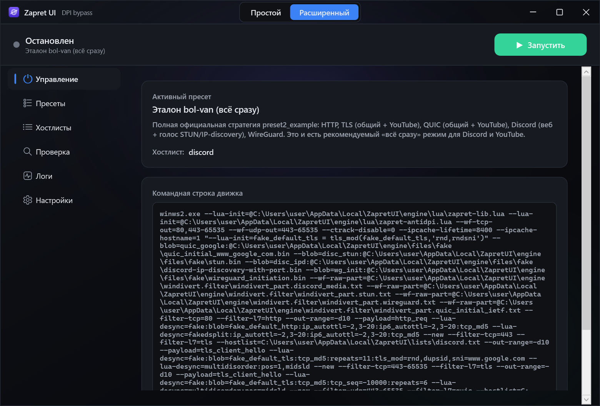
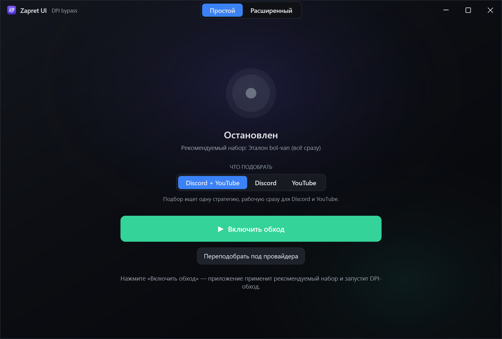
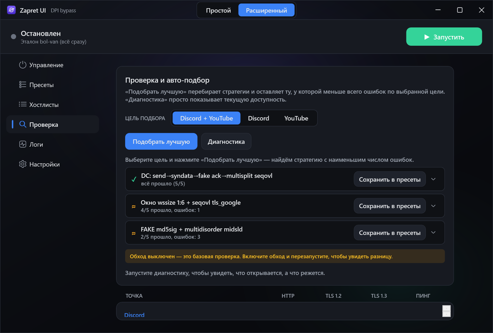
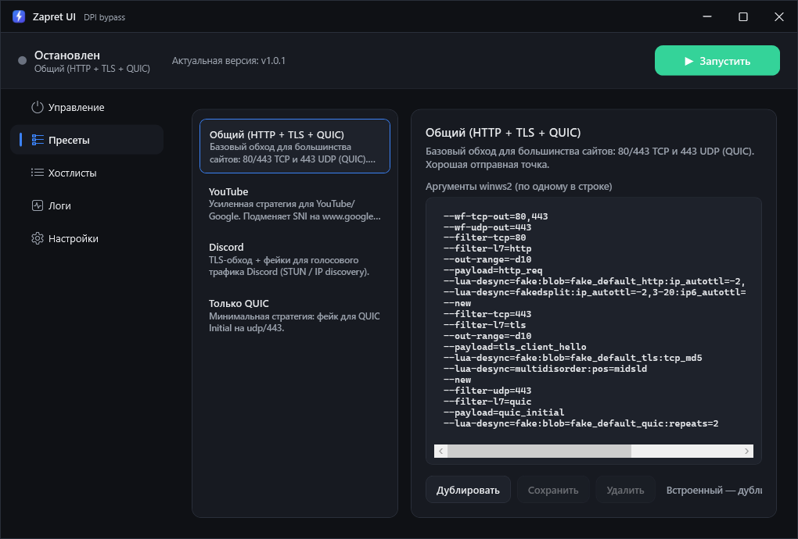
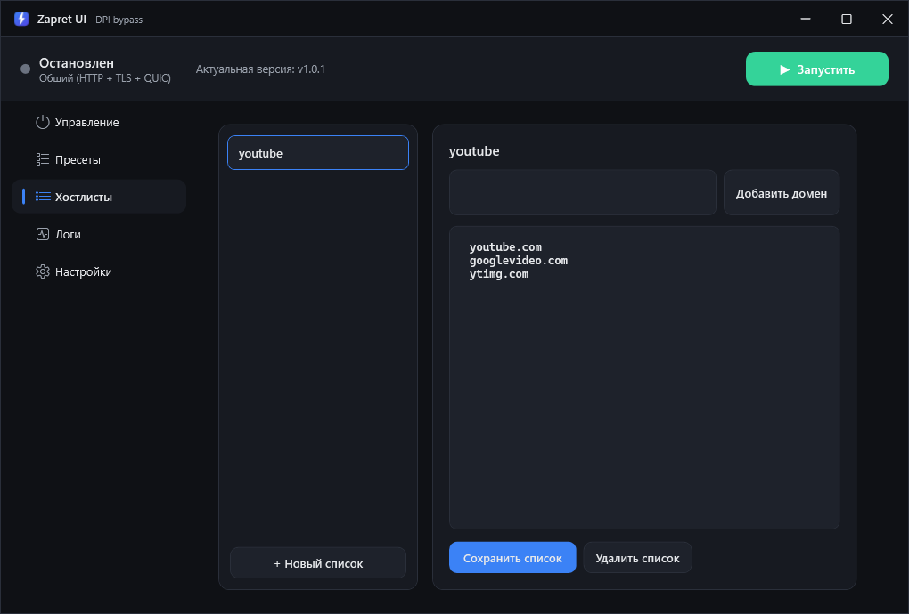
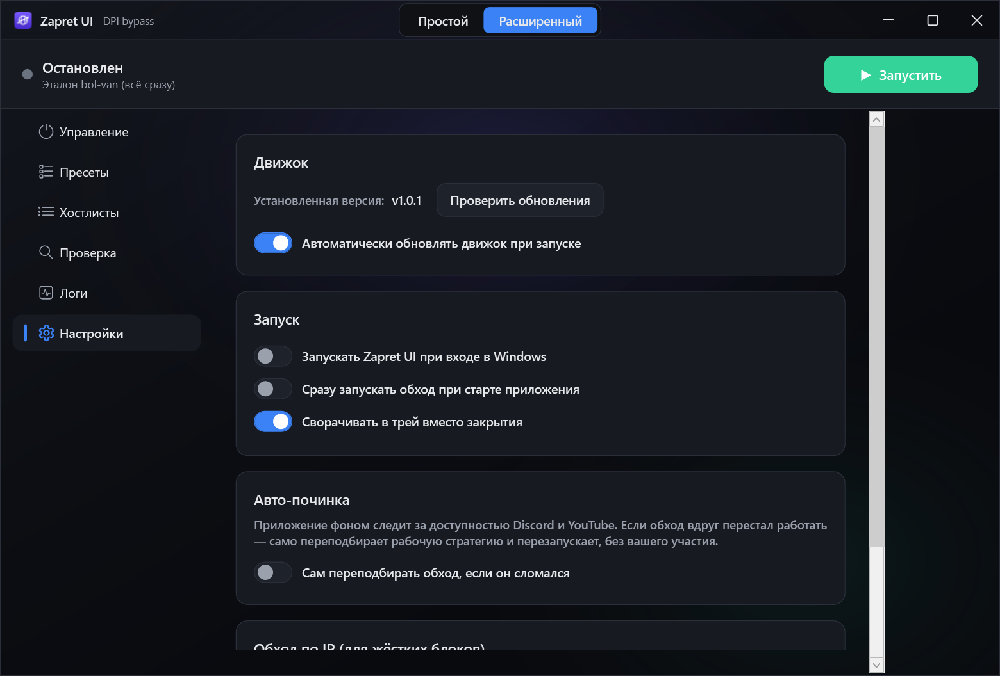

<div align="center">


# Zapret UI

**Графическая оболочка для движка обхода DPI [zapret2](https://github.com/bol-van/zapret2) (winws2) под Windows.**

Тихо скачивает официальный движок с GitHub, проверяет контрольные суммы, держит его в актуальном
состоянии — и даёт управлять обходом блокировок без правки `.cmd`-файлов вручную.



</div>

---

## Что это

Это **не VPN и не прокси**. Сам по себе обход DPI работает так: когда вы открываете сайт, ваш компьютер
отправляет серверу первый пакет, где **открытым текстом видно имя сайта** (SNI в HTTPS, `Host:` в HTTP).
Провайдерский DPI читает это поле и блокирует/замедляет соединение. Движок **winws2** сидит между
приложением и сетью и **портит/разбивает именно этот первый пакет** так, что DPI его не распознаёт, а
настоящий сервер — понимает. Блокировку по имени сайта он обходит; блокировку по IP — нет.

**Zapret UI** — это удобная оболочка над winws2: запуск/остановка одной кнопкой, автоподбор рабочей
стратегии, готовые пресеты, управление списками доменов, живой лог, автозапуск и тихое автообновление
движка.

## Содержание

- [Что это](#что-это) · [Два режима](#два-режима)
- [Скриншоты](#скриншоты)
- [Возможности](#возможности)
- [Почему zapret2, а не обычный zapret](#почему-zapret2-winws2-а-не-обычный-zapret-winwsnfqws1)
- [Как пользоваться](#как-пользоваться)
- [Если не работает](#если-не-работает)
- [Требования](#требования) · [Запуск](#запуск-готовый-бинарник) · [Сборка](#сборка-из-исходников)
- [Где хранятся данные](#где-хранятся-данные) · [Структура кода](#структура-кода)
- [Безопасность](#замечания-по-безопасности) · [Благодарности](#благодарности)
- [VPN от автора — makeitfree.online](#vpn-от-автора--makeitfreeonline)
- [Поддержать автора](#поддержать-автора)

### Два режима

- **Простой** (по умолчанию) — один экран и одна кнопка **«Включить обход»**. Применяет
  рекомендованный пресет и запускает движок. Рядом — кнопка **«Переподобрать под провайдера»**
  (автоподбор) и выбор цели (Discord + YouTube / только Discord / только YouTube). Ничего настраивать
  не нужно.
- **Расширенный** — полный доступ: пресеты, хостлисты, диагностика, авто-подбор, логи, настройки.

Переключение — сегмент **Простой / Расширенный** в заголовке окна.

> ⚠️ Инструмент предназначен для исследовательских и образовательных целей, восстановления доступа к
> легальным ресурсам и тестирования сетей. Используйте в соответствии с законодательством вашей страны.

## Скриншоты

| Простой режим — одна кнопка | Проверка: авто-подбор + диагностика |
|---|---|
|  |  |

| Пресеты | Хостлисты | Настройки |
|---|---|---|
|  |  |  |

## Возможности

- **Старт/стоп + статус** — запуск/остановка `winws2.exe` одной кнопкой, индикатор состояния,
  предпросмотр реальной командной строки движка.
- **Пресеты** — встроенные «комбо»-стратегии на документированном синтаксисе winws2. Каждая в одной
  команде маршрутизирует трафик по SNI (Discord / YouTube / остальное идут через разные десинки) и
  всегда несёт профиль голоса Discord — переключаться между пресетами не нужно:
  «Комбо (рекомендуемый)», «Комбо — Flowseal (multisplit seqovl)», «Комбо — Flowseal ALT
  (fake+fakedsplit)», «Комбо — окно (wssize)» и отдельный «Discord — голос (QUIC-фейк)». Любой можно
  продублировать и отредактировать; пользовательские хранятся в JSON.
- **Хостлисты** — управление списками доменов (txt, один домен на строку), подключение к пресету.
- **Проверка** — два инструмента на одной вкладке:
  - **Авто-подбор** — встроенный blockcheck: выберите цель (Discord + YouTube / Discord / YouTube),
    и приложение само перебирает ~16 многопрофильных стратегий, ищет **одну, что работает сразу для
    всего**, и показывает таблицу результатов по каждой. Любую рабочую можно применить или сохранить
    в пресеты в один клик.
  - **Диагностика** — наглядная матрица доступности ключевых точек (Discord, YouTube, Google,
    Cloudflare, DNS) по столбцам HTTP / TLS 1.2 / TLS 1.3 / пинг — видно, что именно блокируется.
- **Авто-починка** *(опционально)* — фоновый сторож периодически проверяет связь и при устойчивом
  сбое **молча переподбирает** рабочую стратегию, не отвлекая пользователя.
- **Обход по IP (ipset)** — для жёстких блокировок: резолвит домены Discord через `mdig`,
  агрегирует в подсети через `ip2net` и строит список для `--ipset` (когда обход по имени не пробивает).
- **Логи** — живой вывод `--debug` движка + запись в файл.
- **Автообновление движка** — `releases/latest` → загрузка `zapret2-<ver>.zip` → проверка
  **SHA‑256** каждого бинарника по `sha256sum.txt` → распаковка только нужного.
- **Автозапуск** — задача в Планировщике Windows (вход в систему, повышенные права).
- **Трей** — сворачивание вместо закрытия, иконка и уведомления отражают состояние обхода.

---

## Почему zapret2 (winws2), а не обычный zapret (winws/nfqws1)

Эта оболочка намеренно работает с **zapret2** — новым поколением проекта bol-van. Коротко, чем он
принципиально лучше предшественника (nfqws1 / winws первой версии):

### 1. Стратегии пишутся на Lua, а не зашиты в C
В **nfqws1** все техники «дурения» DPI (`fake`, `split`, `disorder`, `fooling` и т.д.) захардкожены в
C‑коде. Чтобы добавить новую технику или подправить существующую, нужно **писать C и пересобирать
бинарник** — высокий порог входа и медленная итерация.

В **nfqws2** C‑ядро отдаёт в **Lua** структурированное дерево пакета — «диссект», как в Wireshark — плюс
библиотеку хелперов (отправка пакетов, работа с бинарными данными, разбор TLS, поиск маркер‑позиций).
Стратегию теперь может написать или поправить **любой, кто понимает сети**, без компиляции. Это
превращает закрытый инструмент в открытую платформу.

### 2. Гибкость вместо «монстро‑комбайна» из сотен опций
nfqws1 со временем оброс сотнями частных флагов (`--dpi-desync-fake-tls`, `--dpi-desync-fake-http`,
`--dpi-desync-fake-quic`, `--dpi-desync-split-pos`, `--dpi-desync-fooling`, …). Это перегружало программу
и плохо масштабировалось: противостояние с регулятором требует всё более тонких и **меняющихся со
временем** воздействий, а старые перестают работать и забываются.

nfqws2 заменяет это **композицией Lua‑функций** (инстансов) и **блобами**. Нет жёстко зашитых фаз вроде
`fake,multisplit` — это просто последовательность вызываемых Lua‑функций, сколько нужно, каждая со своими
параметрами; одну и ту же можно вызвать несколько раз по‑разному.

### 3. Блобы вместо десятков «fake‑*» параметров
Вместо `--dpi-desync-fake-tls/http/quic` в nfqws2 есть **блобы** — произвольные бинарные данные (hex‑строкой
прямо в параметре или из файла). Стандартные фейки `fake_default_tls/http/quic` инициализируются
автоматически, а модификации (рандомизация, подмена SNI, дублирование session id) делаются одной строкой Lua.

### 4. Точечная фильтрация по типу пейлоада
Введено понятие **payload type** (`tls_client_hello`, `http_req`, `quic_initial`, `wireguard_initiation`,
`stun`, `dns_query` …). Стратегии применяются ровно к нужным пакетам — точнее и экономичнее по CPU, что
важно на слабых роутерах.

### 5. Полноценная работа в обе стороны и серверный режим
nfqws2 одинаково работает и с исходящими, и с входящими пакетами (`--out-range` / `--in-range`), есть режим
`--server`. Это открывает не только обход DPI, но и **обфускацию протоколов** (например, туннелирование
WireGuard‑UDP внутри ICMP‑пингов, XOR полезной нагрузки общим секретом).

### 6. Автоматическая TCP‑сегментация
Больше не нужно вручную считать размеры пакетов. Библиотека `zapret-lib.lua` отслеживает MSS соединения и
**сама сегментирует** то, что не влезает (например, большие TLS ClientHello с Kyber или большой `seqovl`).
В nfqws1 такое приводило к ошибке.

### Честная оговорка
zapret2 — **более мощный и гибкий**, но и **более сложный** инструмент; автор прямо пишет, что это «не
готовое решение для чайников». Базовое использование (готовые стратегии) — простое, и именно это берёт на
себя данная оболочка. Написание собственных стратегий требует понимания сетей. Для эволюционирующей борьбы
с DPI гибкость zapret2 — решающее преимущество.

---

## Как пользоваться

**Самый простой путь (Простой режим):**

1. Запустите от **администратора** (без этого WinDivert не загрузит драйвер).
2. Нажмите **«Включить обход»**. Приложение применит рекомендованный пресет и запустит движок.
3. Не помогло? Нажмите **«Переподобрать под провайдера»** — автоподбор сам найдёт рабочую стратегию
   под вашего оператора (можно заранее выбрать цель: Discord + YouTube / Discord / YouTube).

**Расширенный режим (ручное управление):**

1. На вкладке **Пресеты** выберите пресет (по умолчанию **«Комбо (рекомендуемый)»**). В списке пресет,
   который сейчас реально работает, помечен значком **ВКЛЮЧЁН** — видно, что именно запущено, а не просто
   выделено.
2. Нажмите **Запустить** в шапке — индикатор станет зелёным, в **Логах** пойдёт вывод движка.
3. **Смена стратегии на лету.** Если движок уже работает и вы выбрали *другой* пресет, появится плашка
   **«Сменить стратегию»** — стратегию нельзя поменять без перезапуска движка, поэтому смена применяется
   только после подтверждения этой кнопкой (движок перезапустится на выбранном пресете).
4. Проверьте доступ к нужному сайту. Если не помогло — вкладка **Проверка** или см. ниже.

**Хостлисты нужны не всегда.** Встроенные комбо-пресеты сами разбивают трафик по SNI через списки
`youtube` и `discord` (вкладка **Хостлисты**, засеяны по умолчанию). Правьте их, только если хотите
добавить/убрать домены, к которым применяются спец-стратегии.

## Если не работает

Обход DPI **зависит от провайдера** — одна и та же стратегия у разных операторов ведёт себя по-разному.
Универсального пресета не существует. Действуйте по шагам:

1. **Смотрите вкладку Логи.** Если движок не стартовал — там будет ошибка (аргументы, драйвер).
2. **Антивирус.** WinDivert — частая цель антивирусов; Defender может заблокировать драйвер или забрать
   `winws2.exe`/`WinDivert64.sys` в карантин. Добавьте папку `%LOCALAPPDATA%\ZapretUI\engine` в исключения.
3. **Запустите диагностику.** Вкладка **Проверка** → **Диагностика**: матрица покажет, что именно
   не открывается (HTTP / TLS 1.2 / TLS 1.3 / пинг) по Discord, YouTube, Google, Cloudflare и DNS.
4. **Подберите стратегию под себя.** Там же → выберите цель и нажмите **«Подобрать лучшую»** —
   авто-тестер перебирает многопрофильные стратегии и ищет одну, что пробивает сразу всё нужное у
   вашего провайдера. Рабочую примените или сохраните в пресеты в один клик. Это правильный способ,
   когда готовые пресеты не подошли.
5. **Перебирайте пресеты вручную.** Начните с «Комбо (рекомендуемый)», затем «Комбо — Flowseal
   (multisplit seqovl)» и «Комбо — Flowseal ALT». Если упирается вход в Discord — «Комбо — окно
   (wssize)». Если голос «подключается, но не слышно / NO_ROUTE» — отдельный «Discord — голос
   (QUIC-фейк)».
6. **Помните про IP-блокировки сайтов.** Если ресурс режут по IP (а не по имени), обход DPI бессилен —
   нужен VPN/прокси (см. [makeitfree.online](#vpn-от-автора--makeitfreeonline)).

## Требования

- Windows 10/11 x64.
- **Права администратора** — обязательны: WinDivert загружает драйвер в ядро (манифест требует elevation,
  при запуске будет запрос UAC).
- Интернет при первом запуске (для загрузки движка).

## Запуск (готовый бинарник)

```
publish\ZapretUI.exe
```
Self‑contained single‑file: .NET ставить не нужно. При первом запуске движок скачается сам, проверится по
SHA‑256 и распакуется в `%LOCALAPPDATA%\ZapretUI\engine`. Дальше: выбрать пресет → **Запустить**.

## Сборка из исходников

```powershell
# запуск для разработки
dotnet run --project ZapretUI.csproj

# релизный self-contained single-file exe (~162 МБ, ничего не требует у пользователя)
dotnet publish ZapretUI.csproj -c Release -o publish
```

Для маленького бинарника (~2 МБ, но нужен установленный **.NET 9 Desktop Runtime**) соберите
framework‑dependent: уберите из `.csproj` свойства `SelfContained`, `PublishSingleFile`, `RuntimeIdentifier`.

## Где хранятся данные

Всё под `%LOCALAPPDATA%\ZapretUI\`:

| Папка/файл | Назначение |
|---|---|
| `engine\` | скачанный движок (winws2.exe, WinDivert, lua\, files\, windivert.filter\) + `installed_version.txt` |
| `lists\*.txt` | хостлисты + `ipset-discord.txt` (построенный список IP) |
| `logs\` | логи движка и `fatal.log` |
| `presets.json` | пользовательские пресеты |
| `settings.json` | настройки приложения |

## Структура кода

- `Services/`:
  - `UpdaterService` — загрузка/проверка SHA‑256/распаковка движка с GitHub.
  - `EngineService` — запуск/остановка winws2, сборка аргументов (раскрытие токенов
    `{FILES}`/`{WF}`/`{HOSTLIST}`/`{IPSET}`), логи.
  - `PresetService`, `HostlistService`, `SettingsService`, `AutostartService`, `AppPaths`.
  - `ComboStrategyCatalog` + `AutoSelectService` — пул многопрофильных стратегий и авто-подбор
    лучшей по числу успехов (цель — одна стратегия на YouTube и Discord сразу).
  - `DiagnosticsService` + `NetProbe` — матрица доступности точек (ping / HTTP / TLS 1.2 / TLS 1.3).
  - `IpsetService` — построение IP‑списка Discord (`mdig` → `ip2net`).
  - `MonitorService` — фоновый сторож для авто‑починки.
- `ViewModels/MainViewModel.cs` — координатор (MVVM).
- `Mvvm/` — базовый `ObservableObject`, `RelayCommand`, конвертеры.
- `Themes/Theme.xaml` — тёмная тема и стили контролов.
- `MainWindow.xaml` — окно: кастомный заголовок, два режима (Простой/Расширенный), боковая навигация,
  6 разделов (Управление, Пресеты, Хостлисты, Проверка, Логи, Настройки).

## Замечания по безопасности

- Загрузка идёт по HTTPS с GitHub, бинарники сверяются с `sha256sum.txt` из того же релиза.
- Внешних NuGet‑зависимостей нет — только базовый .NET (HTTP/Zip/SHA‑256/JSON), WinForms‑трей и
  `schtasks.exe` для автозапуска.
- Распаковка архива защищена от path traversal.

## Благодарности

- [bol-van/zapret2](https://github.com/bol-van/zapret2) - собственно движок обхода DPI (winws2) и
  авторитетная документация. Эта оболочка лишь предоставляет ему удобный интерфейс.
- [Flowseal/zapret-discord-youtube](https://github.com/Flowseal/zapret-discord-youtube) - рабочие наборы
  стратегий под Discord/YouTube. Часть встроенных пресетов (включая починку голоса QUIC-фейком и
  multisplit+seqovl) построена по аналогии с его конфигами, переведёнными с nfqws1 на синтаксис nfqws2.
- [RaccoonLaptop/ZapretUI](https://github.com/RaccoonLaptop/ZapretUI) - Вдохновитель проекта в цело(сделать нормальный интерфейс к zapret)


## VPN от автора — makeitfree.online

Помимо этой оболочки, у автора есть **[makeitfree.online](https://makeitfree.online)** — собственный
**VPN-сервис** и VPN-клиенты под **Android и Windows**. Это отдельный проект; он **не open-source**, и
репозитория по нему пока нет.

📱 Telegram-канал с клиентами и новостями: **[t.me/makeitfreevpn](https://t.me/makeitfreevpn)**

> Обход DPI помогает, когда ресурс режут *по имени*. Если же блокировка идёт *по IP* — нужен полноценный
> VPN, и тут как раз пригодится makeitfree.

## Поддержать автора

Если проект оказался полезным и хотите отблагодарить — буду признателен за поддержку:
**[web.tribute.tg/d/HFh](https://web.tribute.tg/d/HFh)** 💚

## Лицензия

MIT (см. `LICENSE`). Движок winws2 распространяется по своей лицензии — см. репозиторий zapret2.

---


