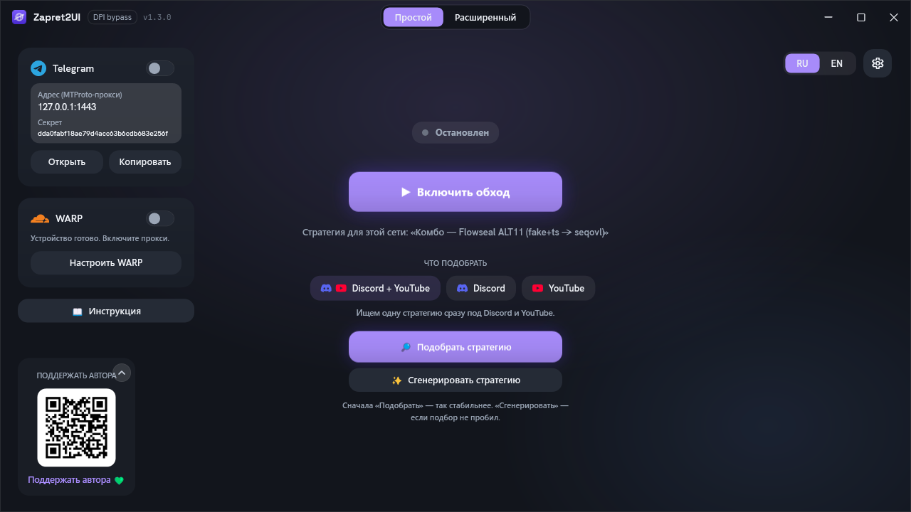
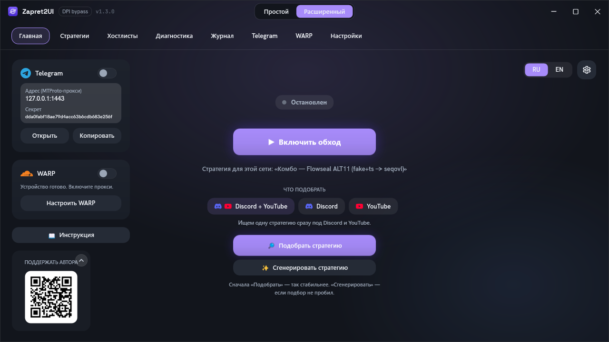

<div align="center">

[EN](README.en.md "Read this in English") | **RU**


# Zapret2UI

**Программа, которая одной кнопкой возвращает доступ к Discord, YouTube и Telegram на Windows.**

<p>
  
  &nbsp;&nbsp;&nbsp;&nbsp;
  
  &nbsp;&nbsp;&nbsp;&nbsp;
  
</p>

<p>
  <a href="https://github.com/Asterlike/zapret2UI/releases/latest"></a>
  <a href="https://github.com/Asterlike/zapret2UI/releases"></a>
  <a href="https://github.com/Asterlike/zapret2UI/stargazers"></a>
  <a href="https://t.me/Zapret2UI"></a>
</p>

<p>
  <a href="https://github.com/Asterlike/zapret2UI/releases/latest"></a>
  &nbsp;
  <a href="https://asterlike.github.io/zapret2UI/"></a>
</p>

Удобная оболочка для движка обхода блокировок [zapret2](https://github.com/bol-van/zapret2) (`winws2`).
Не нужно править `.cmd`-файлы, разбираться в командной строке и вручную подбирать параметры —
нажали кнопку, и всё работает. А если у вашего провайдера не заработало сразу — программа сама
переберёт способы обхода и подстроится под вашу сеть.

Чат, новости и список изменений — в [Telegram-канале Zapret2UI](https://t.me/Zapret2UI).



</div>

> ⚠️ Инструмент для исследовательских и образовательных целей, восстановления доступа к легальным
> ресурсам и тестирования сетей. Используйте по законам своей страны.

---

## Документация

Здесь — короткая выжимка. Всё подробно разобрано на **[сайте документации](https://asterlike.github.io/zapret2UI/)**:

| Раздел | О чём |
|---|---|
| [Как это работает](https://asterlike.github.io/zapret2UI/how-it-works.html) | Теория без формул: SNI и DPI, разрезка, фейковые пакеты, fooling, zapret2 против zapret, чем это не VPN |
| [Быстрый старт](https://asterlike.github.io/zapret2UI/quickstart.html) | Установка, первый запуск, подбор и генерация, автозапуск |
| [Интерфейс](https://asterlike.github.io/zapret2UI/interface.html) | Каждый экран со скриншотом, хостлисты, прокси Telegram, все настройки, файлы на диске |
| [Разбор стратегий](https://asterlike.github.io/zapret2UI/strategies.html) | Девять встроенных стратегий построчно: что делает каждый аргумент и почему собрано именно так |
| [Справочник](https://asterlike.github.io/zapret2UI/reference.html) | Формат аргументов `winws2`: глаголы desync, fooling, токены, маркеры, блобы, оркестраторы |
| [Если не работает](https://asterlike.github.io/zapret2UI/troubleshooting.html) | Порядок действий, коды выхода движка, частые вопросы |
| [Поддержать](https://asterlike.github.io/zapret2UI/support.html) · [Благодарности](https://asterlike.github.io/zapret2UI/credits.html) | Донат, обратная связь и все, на ком стоит проект |

На сайте есть поиск (`Ctrl K`), тёмная тема и скриншоты, которые открываются крупно.
Тот же материал одним файлом для чтения офлайн — [manual_zapret2UI.md](manual_zapret2UI.md).

English version: **[README.en.md](README.en.md)** · [documentation](https://asterlike.github.io/zapret2UI/en/) ·
[manual](manual_zapret2UI.en.md). Интерфейс доступен на русском и английском — переключатель **RU | EN**
на «Главной» и в «Настройках» (переключение перезапускает программу).

---

## Содержание

- [Это zapret2, а не обычный zapret](#это-zapret2-а-не-обычный-zapret)
- [Что умеет программа](#что-умеет-программа)
- [Быстрый старт](#быстрый-старт)
- [Экран за экраном](#экран-за-экраном)
- [Telegram](#telegram)
- [Как это работает](#как-это-работает)
- [Если не работает](#если-не-работает)
- [Частые вопросы](#частые-вопросы)
- [Файлы и удаление](#файлы-и-удаление)
- [Сборка](#сборка)
- [Поддержать](#поддержать)

---

## Это zapret2, а не обычный zapret

Программа работает с **zapret2** (движок `winws2`) — новым поколением проекта bol-van. Со старым
zapret (`winws`) оно **не совместимо**: другие имена аргументов, другой формат стратегий, свой драйвер.

Если вы раньше пользовались обычным zapret или сборками вроде «Zapret 2 GUI» (внутри у них, несмотря
на цифру в названии, чаще всего первый zapret) — **старые конфиги сюда не подходят** и просто не
запустятся.

Подробнее в документации: [Как это работает → Это zapret2, а не обычный zapret](https://asterlike.github.io/zapret2UI/how-it-works.html#ne-zapret1).
Официальный мануал движка — [manual.en.md](https://github.com/bol-van/zapret2/blob/master/docs/manual.en.md).

---

## Что умеет программа

- **Обход блокировок в один клик** для Discord и YouTube — без ручной настройки.
- **Отдельный встроенный прокси для Telegram** (MTProto) — работает сам по себе, права администратора
  для него не нужны.
- **9 готовых стратегий** обхода + **авто-подбор** лучшей из них + **генерация личной стратегии**,
  собранной именно под вашего провайдера.
- **Память по сетям** — программа запоминает рабочую стратегию для каждой сети (Wi-Fi дома, на работе,
  мобильный интернет) и в следующий раз включает её сама.
- **Авто-починка** — если обход перестал работать (провайдер обновил фильтры), программа замечает это
  и молча переподбирает рабочий вариант.
- **Диагностика** — таблица доступности плюс отдельная проверка, режет ли провайдер именно по DPI.
- **Встроенный Cloudflare WARP** как локальный SOCKS5-прокси — вторая половина задачи. Обход снимает
  первую преграду: провайдер не даёт достучаться до сайта. Вторая преграда — сам сайт: он смотрит, с
  какого адреса вы пришли, и сверяется с репутацией. Домашние российские диапазоны у антифрод-систем
  на плохом счету, и низкое доверие достаётся всему диапазону разом — отсюда бесконечная капча,
  «доступ ограничен» и отказы при регистрации или оплате, хотя сайт открывается и провайдер ни при чём.
  Адреса WARP принадлежат Cloudflare, через которую и так проходит заметная часть веба, поэтому в
  списках доверия они стоят иначе: **вы приходите не из плохого диапазона, а как клиент Cloudflare** —
  и та же проверка вас пропускает.
  Клиент лежит внутри программы, **ставить ничего не нужно** и **права администратора не требуются**:
  ни адаптера, ни маршрутов, ни изменений в системе, поэтому неудача не может оставить вас без
  интернета. Работает по протоколу MASQUE — тому же, которым ходит официальное приложение Cloudflare.
  *Страну это не меняет:* бесплатный WARP выводит через ближайший узел, из России адрес будет
  российским, и «недоступно в вашем регионе» так не обойти — меняется репутация адреса, а не страна.
  Пока прокси включён, **область обхода сама расширяется на все сайты** — иначе подключение к
  Cloudflare не встаёт; ваша настройка сохраняется и возвращается при выключении. Обычно через прокси
  идёт только то, что вы в него направили, но отдельным тумблером его можно прописать в настройках
  Windows и пустить через него **весь трафик системы** (Firefox читает свою настройку и не
  покрывается).
- **Свои списки сайтов** (хостлисты) и **свои цели** — можно добавить любой домен.
- **Автозапуск** при входе в Windows, сворачивание в трей, тихие уведомления в углу.
- **Резервная копия настроек и стратегий** в один файл — для переустановки или переноса на другой
  компьютер, плюс **сброс настроек** к исходным без потери своих стратегий.
- **Один файл, без установки.** Движок скачивается при первом запуске и проверяется по SHA-256.

---

## Быстрый старт

Скачайте один файл **`Zapret2UI.exe`** со [страницы релизов](https://github.com/Asterlike/zapret2UI/releases/latest) —
установка не нужна, .NET ставить не надо. Обычно хватает первых двух шагов.

**1. Запустите от имени администратора.**
Правой кнопкой по значку → «Запуск от имени администратора» (или согласитесь на запрос UAC). Движку
нужно загрузить сетевой драйвер в ядро Windows — без прав администратора обход не включится.

**2. Нажмите большую кнопку «Включить обход».**
Точка статуса станет зелёной, надпись — «Работает». Проверьте Discord и YouTube: в большинстве случаев
на этом всё и заканчивается.

**3. Не открылось? Вкладка «Диагностика» → «Подобрать».**
Программа переберёт готовые стратегии, проверит доступность и оставит лучшую. Не помогло — там же
**«Сгенерировать»**: дольше, но собирает стратегию под вашу сеть.

**4. Настройки → «Добавить в исключения».**
Антивирус — самая частая причина, по которой обход «не работает» или движок «пропадает». Кнопка одним
нажатием пропишет программу и папку движка в Защитник Windows и брандмауэр.

> 💡 Настраивать заново обычно не приходится: программа запоминает удачную стратегию для каждой сети
> (по адресу роутера, в интернет при этом ничего не отправляется).

Подробнее в документации: [Быстрый старт](https://asterlike.github.io/zapret2UI/quickstart.html).

---

## Экран за экраном

Вверху по центру — переключатель **Простой / Расширенный**. Простой оставляет кнопку включения,
карточки Telegram и WARP и выбор цели; расширенный добавляет восемь вкладок.



| Вкладка | Что там |
|---|---|
| **Главная** | Кнопка включения, состояние, цель обхода (Discord / YouTube / оба), карточки Telegram и WARP, кнопки подбора и генерации |
| **Стратегии** | Список готовых способов обхода и ваши сохранённые. Выбрать строку → «Применить» |
| **Хостлисты** | Списки доменов, к которым применяется обход. Встроенные обновляются сами, ваши не трогаются |
| **Диагностика** | Таблица доступности по сервисам, подбор, генерация и «Проверка DPI» |
| **Журнал** | Живой вывод движка и прокси. Сюда смотреть в первую очередь, если обход не запустился |
| **Telegram** | Встроенный прокси: адрес, секрет, порт, автозапуск |
| **WARP** | Прокси Cloudflare для смены адреса: создать устройство, включить, куда вписать адрес |
| **Настройки** | Четыре раздела: **Вид** (язык, масштаб, уведомления), **Обход** (область, игровой фильтр, QUIC, Telegram через движок), **Система** (движок, запуск, авто-починка, проверка окружения), **Обслуживание** (IP-список, исключения, копия, сброс, логи) |

Подробнее в документации: [Интерфейс](https://asterlike.github.io/zapret2UI/interface.html) — каждый
экран со скриншотом, полная таблица настроек и разбор хостлистов.

---

## Telegram

Telegram блокируют иначе, чем сайты, — часто **по IP-адресам**, а не по имени. Обычный обход DPI тут
не поможет, поэтому в программе есть **отдельный встроенный прокси** (MTProto). Он работает сам по
себе, **не зависит от основной кнопки обхода**, и права администратора для него **не нужны**.

1. Включите **тумблер Telegram** (на «Главной» или на вкладке «Telegram»).
2. Нажмите **«Открыть в Telegram»** — прокси пропишется в приложение автоматически.
3. Готово. Оставьте тумблер включённым, пока пользуетесь Telegram.

> 💡 Прокси работает, даже когда окно свёрнуто в трей. Если Telegram не подхватил его автоматически —
> **Настройки → Данные и память → Прокси**, добавьте вручную: адрес, порт и секрет показаны на вкладке
> «Telegram», кнопка «Копировать» рядом.

Механизм тот же, что у [Flowseal/tg-ws-proxy](https://github.com/Flowseal/tg-ws-proxy): MTProto поверх
WebSocket-TLS, а при перекрытом прямом пути — через домены за Cloudflare. Разница в том, что оригинал
это отдельная программа на Python, а здесь протокол **переписан на C#** и встроен в приложение: без
второго процесса и Python-рантайма.

Второе отличие — **переписка и медиа идут разными путями**. Telegram качает файлы отдельно от
переписки и сразу несколькими соединениями. В оригинале и то и другое уходит одной дорогой, упираясь в
один узел, — получается знакомая картина: переписка летает, а фото и видео не открываются.

Здесь путь зависит от того, что именно едет. Переписка идёт **напрямую к Telegram**: так быстрее и без
посредника, а сообщения маленькие. Медиа предпочитает **домены за Cloudflare** — они возят объём на
полной скорости, и параллельные загрузки раскидываются сразу по нескольким узлам. Каждый путь при этом
страхует второй, так что недоступность одного не оставляет без связи. Разница между ними в том, что
прямая дорога ведёт на собственные адреса Telegram, которым чаще **ограничивают скорость**, а не
закрывают совсем: соединение открывается как ни в чём не бывало, но объём по нему еле ползёт.

Третье — **крупные сообщения собираются обратно**. Канал вправе разрезать одно сообщение на несколько
частей, и разрезаются только большие, то есть файлы. Потерянное продолжение ломает шифрование потока
без возможности восстановления — снаружи это выглядит как «медиа то грузится, то нет».

Подробнее в документации: [Интерфейс → Telegram](https://asterlike.github.io/zapret2UI/interface.html#telegram).

---

## Как это работает

- **Как вас блокируют.** В начале защищённого соединения браузер сообщает имя сайта открытым текстом
  (поле **SNI**). Оборудование провайдера (**DPI/ТСПУ**) читает его и обрывает соединение.
- **Что делает обход.** Движок `winws2` слегка меняет первые пакеты так, что DPI **не распознаёт имя
  сайта**, а сервер понимает всё правильно. Набор таких приёмов — это и есть **стратегия**.
- **Почему стратегий девять.** Провайдеры фильтруют по-разному: приём, пробивающий блокировку у
  одного, бесполезен у другого. Отсюда подбор и генерация.
- **Чего обход не умеет.** Он снимает блокировку **по имени** сайта. Если ресурс режут **по IP** —
  поможет только VPN (или встроенный прокси, если это Telegram).

Подробнее в документации: [Как это работает](https://asterlike.github.io/zapret2UI/how-it-works.html) —
разрезка, фейковые пакеты, fooling и почему фейк обязан умереть по дороге.

---

## Если не работает

Идите по шагам сверху вниз — почти всегда срабатывает один из первых трёх.

1. **Переберите стратегии вручную** («Стратегии» → выбрать → «Применить») в порядке сверху вниз:
   `Комбо (рекомендуемый)` → `отечественный (VK)` → `ALT10` → `ALT11` → `Flowseal (multisplit)` →
   `Flowseal ALT` → `окно (wssize)` → `адаптивный`.
   > Голос Discord «подключается, но не слышно» — отдельно попробуйте `Discord — голос (QUIC-фейк)`.
2. **Подберите или сгенерируйте** — «Диагностика» → «Подобрать», не нашлось — «Сгенерировать».
3. **Добавьте в исключения** — Настройки → «Добавить в исключения» (антивирус).
4. **Выключите QUIC** — Настройки → отключить **QUIC / HTTP-3**. Классический рецепт для «YouTube
   буферизует».
5. **Проверьте журнал** — если там ошибка запуска, проблема не в стратегии, а в движке.
6. **Проверка DPI с выключенным обходом** — если пишет «нет соединения», это блокировка по IP, и
   поможет только VPN.

Подробнее в документации: [Если не работает](https://asterlike.github.io/zapret2UI/troubleshooting.html) —
разбор по симптомам для Discord и YouTube, коды выхода движка и случай «всё зелёное, а сайт не
открывается».

---

## Частые вопросы

**Антивирус удаляет `winws2.exe` или пишет «движок не найден».**
Ложное срабатывание, обычное дело для средств обхода. Настройки → «Добавить в исключения», затем
обновите движок там же или перезапустите программу — он скачается заново.

**Работало, а потом перестало.**
Провайдер обновил фильтры. Включите **авто-починку** в Настройках либо заново нажмите «Подобрать».

**В Discord есть текст, но не работает голос.**
Голос идёт по UDP на высоких портах. Попробуйте `Discord — голос (QUIC-фейк)` или `ALT10`/`ALT11`.

**YouTube открывается, но видео бесконечно грузится.**
Часто виноват QUIC. Настройки → отключить **QUIC / HTTP-3**.

**В диагностике всё зелёное, но сайт не открывается.**
Сайт может резаться иначе (ECH, блокировка по IP) — попробуйте другую стратегию или отключите QUIC.
Если сайт грузится бесконечно, но `curl` отдаёт его мгновенно — это QUIC: добавьте домен в «Свои цели»
и включите «Отключить QUIC». Если же сайт открывается, но отказывает лично вам (капча без конца,
«доступ ограничен», отказ при регистрации) — дело не в провайдере, а в репутации вашего адреса: это
к **WARP**.

**Нужны ли права администратора?**
Для обхода Discord/YouTube — да. Для прокси Telegram — **нет**.

Остальные вопросы: [Если не работает → Частые вопросы](https://asterlike.github.io/zapret2UI/troubleshooting.html#voprosy).

---

## Файлы и удаление

Программа **портативная**: не устанавливается в `Program Files` и почти не трогает систему. Все
данные — в одной папке **`%LOCALAPPDATA%\Zapret2UI\`** (быстро открыть: `Win+R` → вставить путь → Enter).

| Что | Где |
|---|---|
| Движок `winws2` и его файлы (качается при первом запуске) | `engine\` |
| Хостлисты и IP-списки | `lists\` |
| Журналы движка (`engine-*.log`) | `logs\` |
| Ваши стратегии | `presets.json` |
| Настройки | `settings.json` |

**Как полностью удалить программу:**

1. Закройте её — правый клик по значку в трее → «Выход».
2. Если включали автозапуск, снимите его: Настройки → выключить «Запускать Zapret2UI при входе в
   Windows» (или вручную:
   `schtasks /delete /tn "Zapret2UI Autostart" /f`).
3. Удалите сам файл `Zapret2UI.exe`.
4. Удалите папку `%LOCALAPPDATA%\Zapret2UI\` — после этого от программы не остаётся ничего.

**Windows пишет «Файл уже используется» на `WinDivert64.sys`?** Это драйвер ядра, он остаётся
загруженным, пока его не выгрузить.

1. Полностью выйдите из приложения: **трей → Выход** (крестик только сворачивает). Убедитесь, что в
   Диспетчере задач нет `winws2.exe`.
2. Откройте **PowerShell от администратора** и выгрузите драйвер:
   ```powershell
   sc.exe stop WinDivert
   sc.exe delete WinDivert
   ```
   > ⚠️ Именно **`sc.exe`**, а не `sc`! В PowerShell `sc` — это псевдоним `Set-Content`, поэтому
   > `sc stop WinDivert` молча не сработает. (В классической `cmd.exe` работает и `sc`.)
3. Теперь папка `engine` удалится.

**Проще:** перезагрузите ПК и удалите папку — драйвер настроен не грузиться сам, после перезагрузки
файл свободен.

> Если добавляли исключения через Настройки, останутся безвредные правила Windows Defender и фаервола
> с именем `Zapret2UI` — при желании их можно убрать в настройках безопасности Windows.

---

## Сборка

Готовый бинарник — `publish\Zapret2UI.exe` (self-contained, .NET ставить не нужно; при первом запуске
движок скачается и проверится по SHA-256).

Из исходников нужен **.NET 9 SDK**:

```powershell
# запуск для разработки
dotnet run --project ZapretUI/ZapretUI.csproj

# релизный self-contained single-file exe
dotnet publish ZapretUI/ZapretUI.csproj -c Release -o publish
```

**Требования:** Windows 10/11 x64, права администратора (движок грузит драйвер в ядро), интернет при
первом запуске. Технологии: .NET 9, WPF; из внешних зависимостей — только Emoji.Wpf (цветные эмодзи).

---

## Поддержать

- **VPN от автора** (для блокировок по IP): **[makeitfree.online](https://makeitfree.online)** ·
  [t.me/makeitfreevpn](https://t.me/makeitfreevpn)
- **Поддержать проект:** **[web.tribute.tg/d/HFh](https://web.tribute.tg/d/HFh)**

Помочь можно и без денег: рассказать в [канале](https://t.me/Zapret2UI), какая стратегия сработала у
какого провайдера, или завести [задачу](https://github.com/Asterlike/zapret2UI/issues) с выводом
журнала. Подробнее в документации: [Поддержать](https://asterlike.github.io/zapret2UI/support.html).

---

## Благодарности

- [bol-van/zapret2](https://github.com/bol-van/zapret2) — сам движок обхода DPI (`winws2`) и документация.
- [Flowseal/zapret-discord-youtube](https://github.com/Flowseal/zapret-discord-youtube) — рабочие
  стратегии и [tg-ws-proxy](https://github.com/Flowseal/tg-ws-proxy).
- [RaccoonLaptop/ZapretUI](https://github.com/RaccoonLaptop/ZapretUI) — вдохновитель проекта.
- [hyperion-cs/dpi-checkers](https://github.com/hyperion-cs/dpi-checkers) — метод проверки лимита по объёму.

Полный список с указанием, что конкретно откуда взято:
[Благодарности](https://asterlike.github.io/zapret2UI/credits.html).

## Лицензия

MIT (см. `LICENSE`). Движок `winws2` распространяется по своей лицензии — см. репозиторий zapret2.
